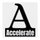

<a name="readme-top"></a>

<!-- PROJECT SHIELDS -->
<!--
*** I'm using markdown "reference style" links for readability.
*** Reference links are enclosed in brackets [ ] instead of parentheses ( ).
*** See the bottom of this document for the declaration of the reference variables
*** for contributors-url, forks-url, etc. This is an optional, concise syntax you may use.
*** https://www.markdownguide.org/basic-syntax/#reference-style-links
-->
[![Contributors][contributors-shield]][contributors-url]
[![Forks][forks-shield]][forks-url]
[![Stargazers][stars-shield]][stars-url]
[![Issues][issues-shield]][issues-url]
[![MIT License][license-shield]][license-url]
[![LinkedIn][linkedin-shield]][linkedin-url]


<!-- PROJECT LOGO -->
<br />
<div align="center">
  <a href="https://github.com/swimswag10/my-patient-coverage">
    
  </a>

  <h3 align="center">MyPatientCoverage</h3>

  <p class="text-neutral-900" align="center">
    Aggregating dental insurance management!
    <br />
    <a href="#">View Demo (not available currently)</a>
    ·
    <a href="https://github.com/othneildrew/Best-README-Template/issues">Report Bug</a>
    ·
    <a href="https://github.com/othneildrew/Best-README-Template/issues">Request Feature</a>
  </p>
</div>


<!-- TABLE OF CONTENTS -->
<details>
  <summary>Table of Contents</summary>
  <ol>
    <li>
      <a href="#about-the-project">About The Project</a>
      <ul>
        <li><a href="#built-with">Built With</a></li>
      </ul>
    </li>
    <li>
      <a href="#getting-started">Getting Started</a>
      <ul>
        <li><a href="#prerequisites">Prerequisites</a></li>
        <li><a href="#installation">Installation</a></li>
      </ul>
    </li>
    <li><a href="#usage">Usage</a></li>
    <li><a href="#roadmap">Roadmap</a></li>
    <li><a href="#contributing">Contributing</a></li>
    <li><a href="#license">License</a></li>
    <li><a href="#contact">Contact</a></li>
    <li><a href="#acknowledgments">Acknowledgments</a></li>
  </ol>
</details>


<!-- ABOUT THE PROJECT -->
## About The Project

[![Product Name Screen Shot][product-screenshot]](https://example.com)

We are aggregating dental insurance management into once web portal for healthcare providers to track EFTs (Electronic Funds Transfers), EOBs (Explaination Of Benefits), and patient insurance plants and coverages.

Here's why:
* Dental providers use legacy systems to manage their dental practice.
* Oftentimes a dental practice insurance manager will operate out of 10-50 insurance web portals to manage their patient's insurance, EFTs, and EOBs.
* Aggregating insurance management will allow us to create new features in a dental practice. An example would be automatic claim submissions.

Of course we cannot do this without the help of other software developers. We are constantly looking for contributors who are willing to create the future of ultimate automated healthcare!

<p align="right">(<a href="#readme-top">back to top</a>)</p>


### Built With

This section should list any major frameworks/libraries used to bootstrap your project. Leave any add-ons/plugins for the acknowledgements section. Here are a few examples.

<!-- * [![Next][Next.js]][Next-url]
* [![React][React.js]][React-url]
* [![Vue][Vue.js]][Vue-url]
* [![Angular][Angular.io]][Angular-url] -->
* [![Svelte][Svelte.dev]][Svelte-url]
<!-- * [![Laravel][Laravel.com]][Laravel-url] -->
* [![Bootstrap][Bootstrap.com]][Bootstrap-url]
<!-- * [![JQuery][JQuery.com]][JQuery-url] -->

<p align="right">(<a href="#readme-top">back to top</a>)</p>


<!-- GETTING STARTED -->
## Getting Started

This is an example of how you may give instructions on setting up your project locally.
To get a local copy up and running follow these simple example steps.

### Prerequisites

This is an example of how to list things you need to use the software and how to install them.
* npm
  ```sh
  npm install npm@latest -g
  ```

### Installation

<!-- 1. Get a free API Key at [https://example.com](https://example.com) -->
This installation assumes you have already configured the AWS CLI with an IAM user that has administrator permissions. It also assumes you have already configured the `cdk` command in your CLI.
1. Clone the repo
  ```sh
  git clone https://github.com/your_username_/Project-Name.git
  ```
2. Navigate to the Sveltekit frontend directory
  ```sh
  cd /app
  ```
3. Install NPM packages
  ```sh
  npm install
  ```
4. Create the 'build' directory for the AWS S3 bucket to store the frontend statically.
  ```sh
  npm run build
  ```
5. Navigate to the AWS CDK serverless directory
  ```sh
  cd ../aws-cdk
  ```
6. Install NPM packages
  ```sh
  npm install
  ```
7. Deploy the CDK stack to your AWS account
  ```sh
  cdk deploy MyPatientCoverage MPCDynamoStack
  ```

<b>For developming locally</b> you will want to make sure you have a username and password set up (or any other login credential) for <b>EACH</b> of the insurance websites. Below, on step two is the example for Delta Dental.
<b>NOTE:</b> this is temporary, and should be fixed in later versions. In the future we will not have to manually add the `username` and `password` values to the lambda logic - it will come from our database values that the user created on account creation.

1. Make sure you have all dedepancies installed
  ``` sh
  npm ci 
  ```
2. Open the file in VS Code (this command only works if you have VS Code cli commands setup)
  ``` sh
  code .
  ```
3. Navigate to the deltaLogin lambda script in your text editor, or alternatively navigate to the directory containing the script through your cli
  ``` sh
  cd aws-cdk/src/deltaLogin
  ```
4. Then, inside of the /deltaLogin/index.js script, change the `username` and `password` inside of the await puppeteer page inputs.
  ``` javascript
  await page.type('input[name="userId"]', 'username')
  await page.type('input[name="password"]', 'password')
  ```


<p align="right">(<a href="#readme-top">back to top</a>)</p>


<!-- ROADMAP -->
## Roadmap

For reference to our Roadmap, refer to our projects board.

<!-- - [x] Add Changelog
- [x] Add back to top links
- [ ] Add Additional Templates w/ Examples
- [ ] Add "components" document to easily copy & paste sections of the readme
- [ ] Multi-language Support
    - [ ] Chinese
    - [ ] Spanish -->

See the [open issues](https://github.com/swimswag10/my-patient-coverage/issues) for a full list of proposed features (and known issues).

<p align="right">(<a href="#readme-top">back to top</a>)</p>


<!-- CONTRIBUTING -->
## Contributing

As you might expect, the actual project is **not** open-sourced. For obvious reasons, the main reason being this project may contain sensitive data about patients.
To become a contributor, you must request to become a contributor. All queries can be sent to: `justinfleagle@gmail.com`

<p align="right">(<a href="#readme-top">back to top</a>)</p>


<!-- LICENSE -->
## License

We do not currently have a license for this project.
<!-- Distributed under the MIT License. See `LICENSE.txt` for more information. -->

<p align="right">(<a href="#readme-top">back to top</a>)</p>


<!-- CONTACT -->
## Contact

Lead Programmer: Justin Fleagle - justinfleagle@gmail.com

<p align="right">(<a href="#readme-top">back to top</a>)</p>


<!-- ACKNOWLEDGMENTS -->
## Acknowledgments

Helpful resources:

* [Choose an Open Source License](https://choosealicense.com)
* [GitHub Emoji Cheat Sheet](https://www.webpagefx.com/tools/emoji-cheat-sheet)
* [Malven's Flexbox Cheatsheet](https://flexbox.malven.co/)
* [Malven's Grid Cheatsheet](https://grid.malven.co/)
* [Img Shields](https://shields.io)
* [GitHub Pages](https://pages.github.com)
* [Font Awesome](https://fontawesome.com)

<p align="right">(<a href="#readme-top">back to top</a>)</p>


<!-- MARKDOWN LINKS & IMAGES -->
<!-- https://www.markdownguide.org/basic-syntax/#reference-style-links -->
[contributors-shield]: https://img.shields.io/github/contributors/othneildrew/Best-README-Template.svg?style=for-the-badge
[contributors-url]: https://github.com/swimswag10/my-patient-coverage/graphs/contributors
[forks-shield]: https://img.shields.io/github/forks/othneildrew/Best-README-Template.svg?style=for-the-badge
[forks-url]: https://github.com/swimswag10/my-patient-coverage/network/members
[stars-shield]: https://img.shields.io/github/stars/othneildrew/Best-README-Template.svg?style=for-the-badge

[stars-url]: https://github.com/swimswag10/my-patient-coverage/stargazers
[issues-shield]: https://img.shields.io/github/issues/othneildrew/Best-README-Template.svg?style=for-the-badge
[issues-url]: https://github.com/swimswag10/my-patient-coverage/issues
<!-- [license-shield]: https://img.shields.io/github/license/othneildrew/Best-README-Template.svg?style=for-the-badge -->
<!-- [license-url]: https://github.com/othneildrew/Best-README-Template/blob/master/LICENSE.txt -->
[linkedin-shield]: https://img.shields.io/badge/-LinkedIn-black.svg?style=for-the-badge&logo=linkedin&colorB=555
[linkedin-url]: https://linkedin.com/in/justin-fleagle-3559401b3/
<!-- [product-screenshot]: images/screenshot.png -->
[Next.js]: https://img.shields.io/badge/next.js-000000?style=for-the-badge&logo=nextdotjs&logoColor=white
[Next-url]: https://nextjs.org/
[React.js]: https://img.shields.io/badge/React-20232A?style=for-the-badge&logo=react&logoColor=61DAFB
[React-url]: https://reactjs.org/
[Vue.js]: https://img.shields.io/badge/Vue.js-35495E?style=for-the-badge&logo=vuedotjs&logoColor=4FC08D
[Vue-url]: https://vuejs.org/
[Angular.io]: https://img.shields.io/badge/Angular-DD0031?style=for-the-badge&logo=angular&logoColor=white
[Angular-url]: https://angular.io/
[Svelte.dev]: https://img.shields.io/badge/Svelte-4A4A55?style=for-the-badge&logo=svelte&logoColor=FF3E00
[Svelte-url]: https://svelte.dev/
[Laravel.com]: https://img.shields.io/badge/Laravel-FF2D20?style=for-the-badge&logo=laravel&logoColor=white
[Laravel-url]: https://laravel.com
[Bootstrap.com]: https://img.shields.io/badge/Bootstrap-563D7C?style=for-the-badge&logo=bootstrap&logoColor=white
[Bootstrap-url]: https://getbootstrap.com
[JQuery.com]: https://img.shields.io/badge/jQuery-0769AD?style=for-the-badge&logo=jquery&logoColor=white
[JQuery-url]: https://jquery.com 
